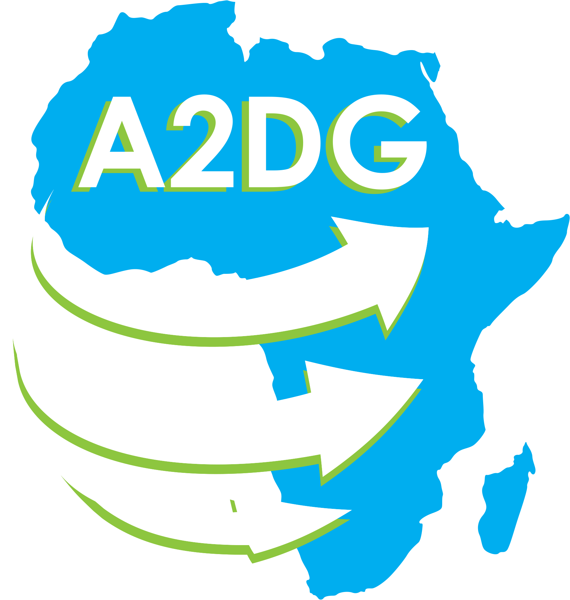

A2DG est une communauté d'enthousiastes, d'utilisateurs et de développeurs africains utilisant la plateforme Dotnet et les technologies Microsoft en général. Elle vise la vulgarisation de ces dernières ainsi que le partage de connaissance et la monté en compétence de ses membres.

### Date de création

- 9 juillet 2016

### Réseaux sociaux

- [Twitter](https://twitter.com/A2DG16)
- [Facebook](https://www.facebook.com/AfricaDotnetDevelopersGroup/)
- [LinkedIn](https://www.linkedin.com/in/a2dg-africa-dotnet-developers-group-b098ab134/)

### Code

- [GitHub](https://github.com/A2DG-SENEGAL)