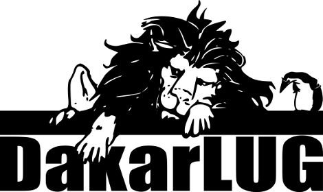

Un groupe de personnes qui vivent à Dakar, utilisent Linux ou d'autres logiciels libres et se retrouvent de temps en temps pour manger des pizzas.

### Site

- [blog.dakarlug.org](https://dakarlug.github.io)

### Réseaux sociaux

- [Facebook](https://www.facebook.com/dakarlug)
- [Twitter](https://twitter.com/dakarlug)

### Photo

- [Flickr](https://www.flickr.com/groups/dakarlug/)

### Archive Mailing

- 

### Code

- [GitHub](https://github.com/Dakarlug)
