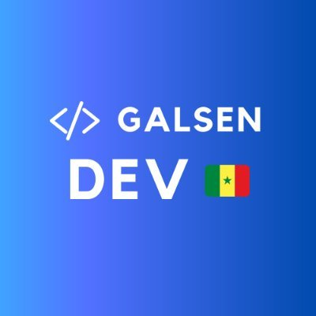

🇸🇳 Galsen DEV est une communauté qui regroupe les développeurs sénégalais dans le but de mettre en place un écosystème favorable à la création et au partage entre développeurs et de vulgariser la programmation partout au Sénégal.

### Date de création

- 18 Mai 2018

### Site

- [galsen.dev](https://www.galsen.dev)

### Réseaux sociaux

- [Discord](https://discord.com/invite/CKZcKqf)
- [Twitter](https://twitter.com/galsendev221)
- [Telegram](https://t.me/galsendev221)
- [Instagram](https://www.instagram.com/galsendev221)
- [Facebook](https://www.facebook.com/galsendev221)

### Code

- [GitHub](https://github.com/GalsenDev221)
