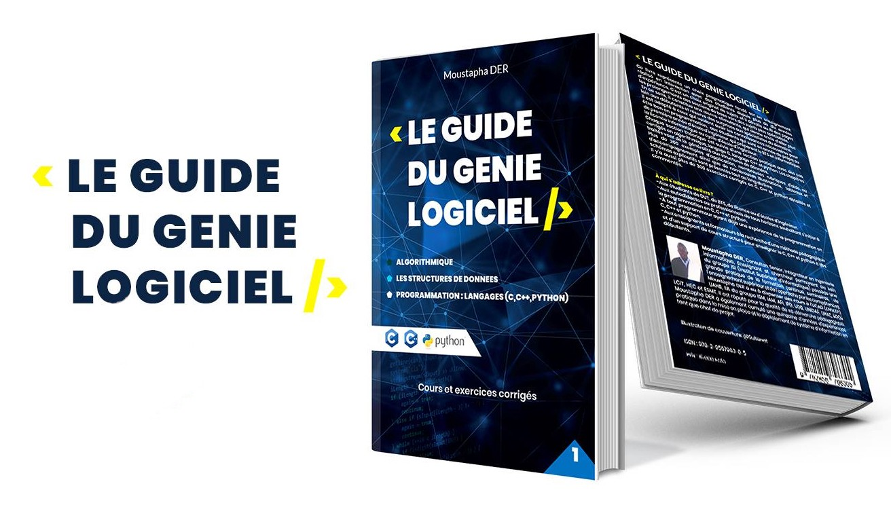

Si vous voulez acquérir des bases solides pour être un très bon développeur de logiciel ce livre est incontournable.

### Auteur: Moustapha DER

Algorithme, structures de données, programmation modulaire, fichiers et pointeurs, tous ces concepts vous seront expliqués de façon très clairs avec des formalismes et exemples accompagnés de TP ou TD en langage C, C++ et PYTHON. Vous trouvez également des exercices corrigés. L'approche par les compétences (APC) qui est utilisé ici est unique en sont genre et très simple pour un autodidacte en informatique mais également pour un informaticien qui veut parfaire son niveau dans le génie logiciel.

### Réseaux sociaux

- [Facebook](https://www.facebook.com/leguidedugenielogiciel/)

### Acheter
- [Amazon - Le guide du génie logiciel Broché](https://www.amazon.fr/guide-du-g%C3%A9nie-logiciel/dp/2956796305/ref=mp_s_a_1_1?crid=MWIP4YPOFJMR&keywords=Moustapha+DER&qid=1639748379&sprefix=moustapha+der%2Caps%2C249&sr=8-1)
- [Amazon - Le guide du génie logiciel tome 2 Broché](https://www.amazon.fr/guide-g%C3%A9nie-logiciel-Moustapha/dp/2956796313/ref=mp_s_a_1_2?crid=MWIP4YPOFJMR&keywords=Moustapha+DER&qid=1639748425&sprefix=moustapha+der%2Caps%2C249&sr=8-2)
- 4 Vents
- Claire Afrique

Vous pouvez également commander en appelant [+221 77 656 84 51](tel:+221776568451) / [+221 77 836 12 12](tel:+221778361212)