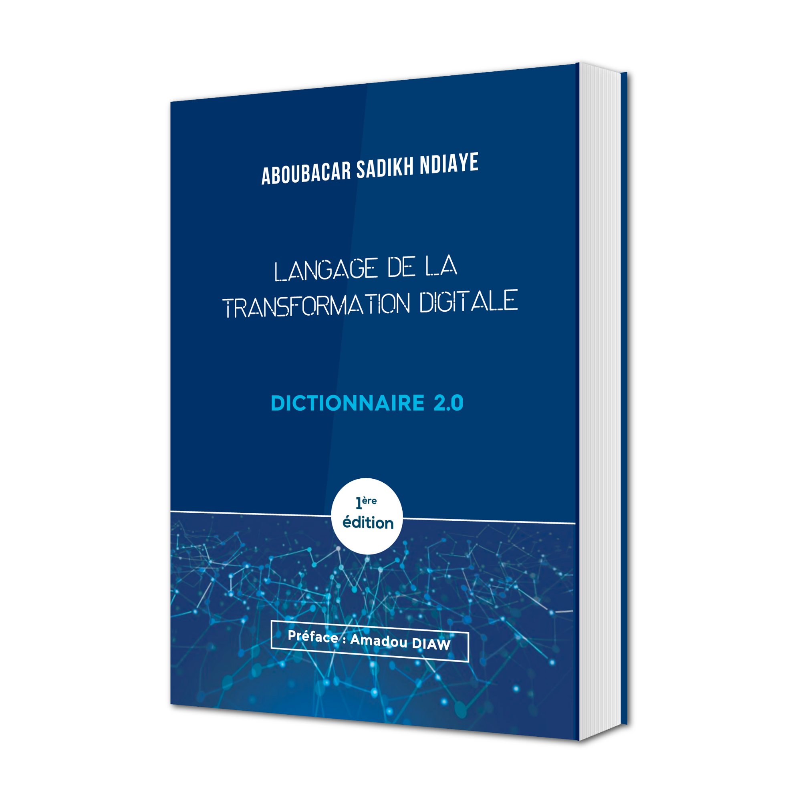
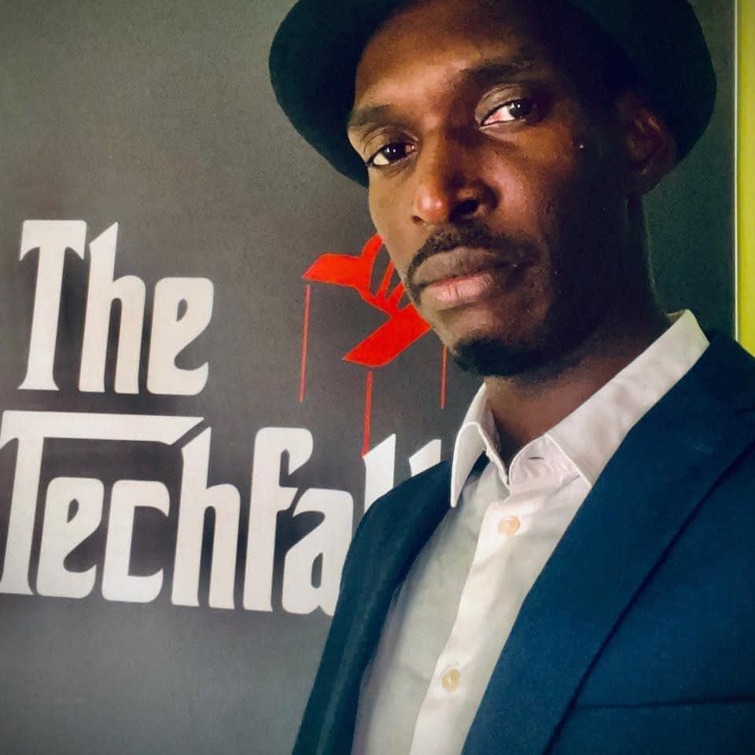

Ce livre inédit écrit par un Sénégalais contribue à l'inclusion numérique pour permettre a tous de comprendre le langage d'Internet, du mobile et de la technologie afin de l'utiliser correctement.

### Auteur: Aboubacar Sadikh Ndiay

Si vous avez besoin d'un dictionnaire pour comprendre le français et bien en faire usage alors ce dictionnaire du web vous sera aussi utile pour comprendre la technologie et le digital qui sont présent dans tout ce que nous faisons.

### Site

- [langagedigital.sn](https://langagedigital.sn)

### Réseaux sociaux

- [Facebook](https://www.facebook.com/langagedelatransformationdigitale)

### Acheter
- [langagedigital.sn](https://langagedigital.sn)

Vous pouvez commander par WhatsApp [+221 77 552 22 27](tel:+221775522227)